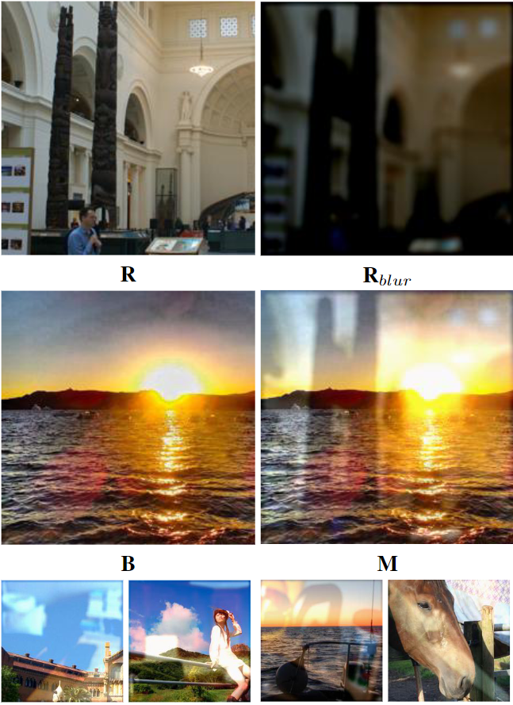

# DereflectFormer: Vision Transformers for Single Image Reflection Removal

> **Abstract:** 
We address the challenge of single image reflection re-
moval (SIRR), a crucial task in computer vision that involves eliminating unde-
sirable reflections from images captured through glass surfaces. Current state-
of-the-art methods typically rely on convolutional neural networks (CNNs) and
often make certain assumptions about the appearance of reflections, which may
not hold true in real-world scenarios. To overcome these limitations, we pro-
pose a novel Transformer-based approach, DereflectFormer, inspired by the Swin
Transformer. Our architecture introduces a new module, the Depthwise Multi-
Activation Feed-Forward Network (DMFN), which leverages depthwise convo-
lution and a dual-stream ReLU-GELU activation function to enhance detail ex-
traction capability. We also employ a synthetic dataset and a synthesis method for
training, which allows our model to fully exploit the capabilities of Transformer
architectures. Experimental results demonstrate that our approach outperforms
state-of-the-art methods, providing more accurate and robust results in various
real-world scenarios. Furthermore, our ablation studies reveal that each compo-
nent of our architecture contributes significantly to its performance, offering valu-
able insights for future research in the field of single image reflection removal.


## Preparation

### Install

We test the code on PyTorch 1.10.2 + CUDA 11.3 + cuDNN 8.2.0.

1. Create a new conda environment
```
conda create -n Dereflectformer python=3.7
conda activate Dereflectformer
```

2. Install dependencies
```
conda install pytorch=1.10.2 torchvision torchaudio cudatoolkit=11.3 -c pytorch
pip install -r requirements.txt
```

### Data Preparation

#### Training dataset
* 7,643 images from the
  [Pascal VOC dataset](http://host.robots.ox.ac.uk/pascal/VOC/), center-cropped as 224 x 224 slices to synthesize training pairs.
* 90 real-world training pairs provided by [Zhang *et al.*](https://github.com/ceciliavision/perceptual-reflection-removal)
* 257 from CID datasets https://sir2data.github.io/
* 13700 synthetic images.

#### Testing dataset
* 45 real-world testing images from [CEILNet dataset](https://github.com/fqnchina/CEILNet).
* 20 real testing pairs provided by [Zhang *et al.*](https://github.com/ceciliavision/perceptual-reflection-removal)
* 454 real testing pairs from [SIR^2 dataset](https://sir2data.github.io/), containing three subsets (i.e., Objects (200), Postcard (199), Wild (55)).
* 72 from CID datasets https://sir2data.github.io/

#### Visual comparison on testing datase


#### Synthetic dataset


#### Ablation study


